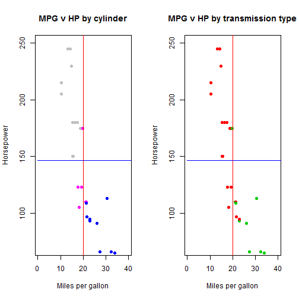
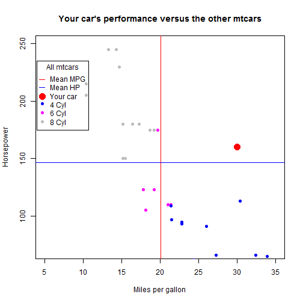

## Overview

The mtcars dataset in R was extracted from the 1974 Motor Trend US magazine, and comprises fuel consumption and 10 aspects of automobile design and performance for 32 automobiles (1973-74 models).

Using data available in the mtcars dataset, this application trains and uses a linear model 
to help predict car performance based on options selected.

The application also produces a summary of specifications.

---
## About mtcars
By observing plotted data from mtcars, we can see that cars with more cylinders tend to have
more horse power, but achieve lower miles per gallon. We can also see that manual transmissions
tend to have better mileage than automatics.

 

---
## About the prediction model

The key factors to the mileage model are:

1. The number of cylinders (cyl)
2. The type of transmission (am)
3. The car weight (wt)
4. The engine displacement (disp)

The model is defined as: lm(mpg~cyl+am+wt+disp,data=mtcars)

The key factors to the horsepower model are:

1. The number of cylinders (cyl)
2. The engine displacement (disp)

The model is defined as: lm(hp~cyl+disp,data=mtcars)

---
## Using the app

By manipulating the configuration options on the left, you can see how they will impact car performance. The model will predict how your car performs relative to the other cars in the mtcars dataset as indicated by a red dot.

 
Use the app: https://ibanezplayer.shinyapps.io/CarDesign/
